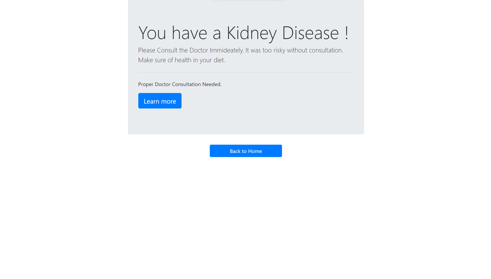

# Chronic Kidney Disease Prediction

A Web Based Kidney Disease prediction app implemented on Random Forest Algorithm and deployed on Flask.

## **Check out <a href="https://rohitiwari.pythonanywhere.com/">_live_</a>**

## *Home:*

## *Result:*

 

## 🔗 Links

